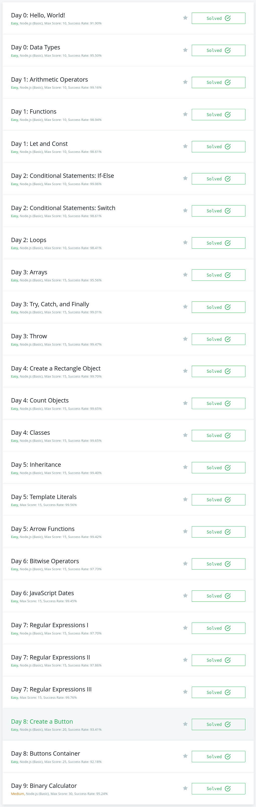
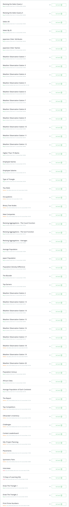

# HackerRank
## Introduction
This repository is for whom starting a learn programming from basic on hackerrank. I have posted all solution code snippets here. Please Don't copy code from here. Coping others code may give you  a start on hackerrank but not in real life happiness that solving a problem comes from. please take this option as way of clear the logic missing from you understanding.
I have solved problems on **(JavaScript, PHP, C++, Python, SQL)** programming languages.
## Courses or Divisions
### 1. [10 Days of Javascript](https://www.hackerrank.com/domains/tutorials/10-days-of-javascript)

### 2. [30 Days of Code](https://www.hackerrank.com/domains/tutorials/30-days-of-code)

### 3. [SQL](https://www.hackerrank.com/domains/sql)

